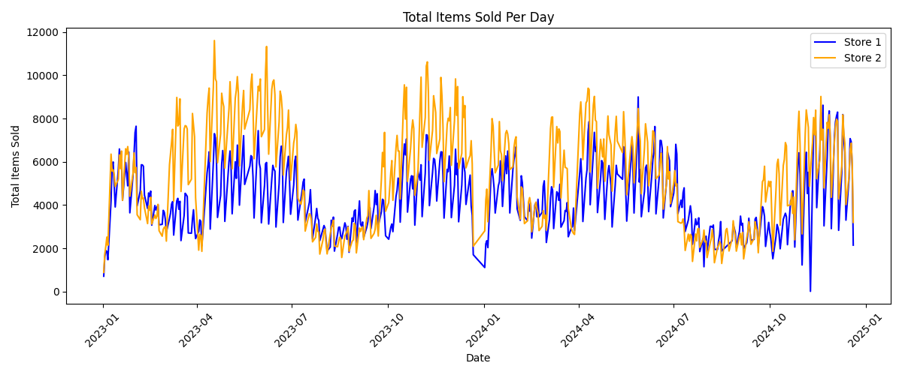
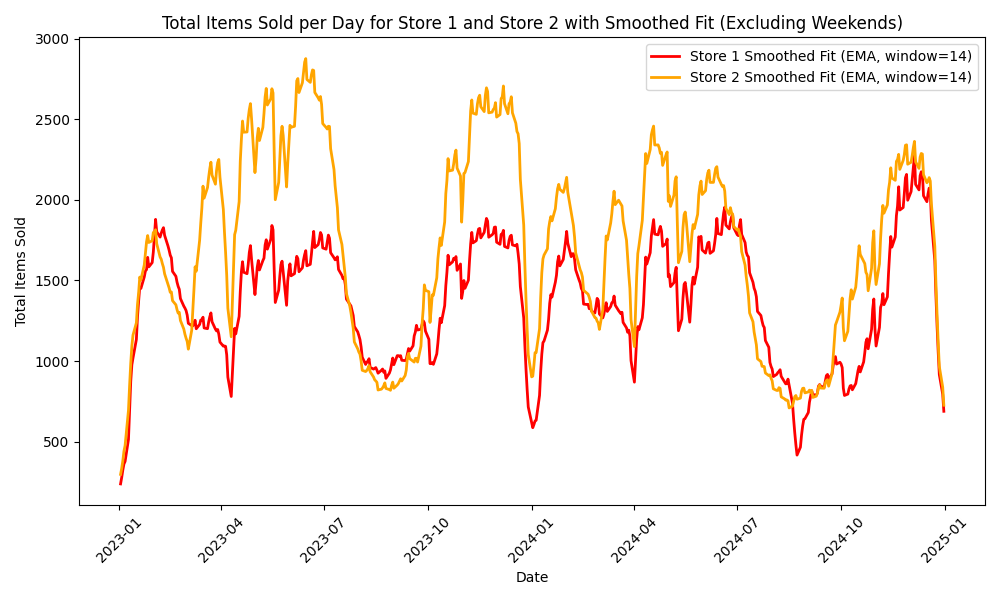
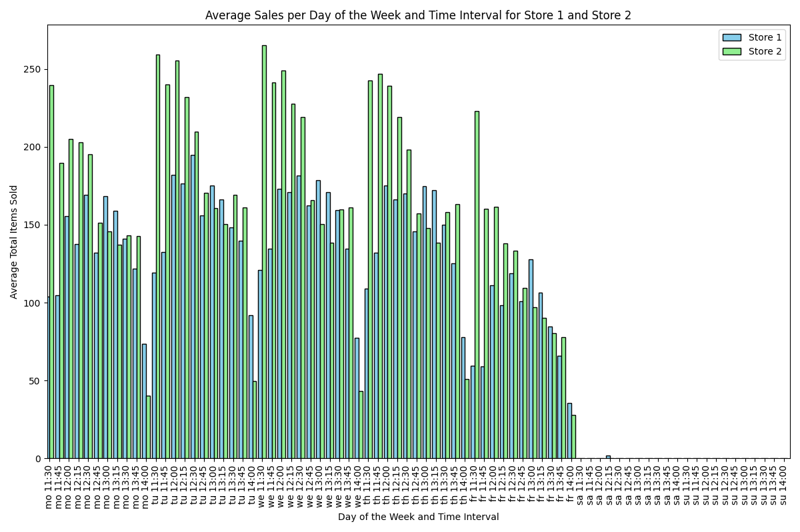
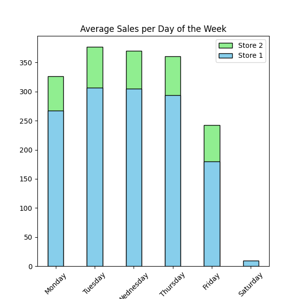
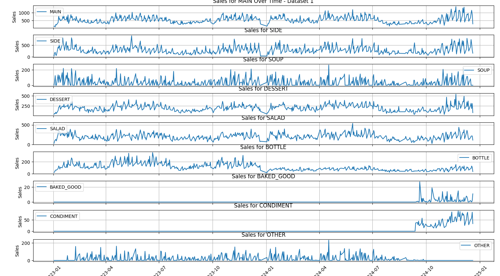
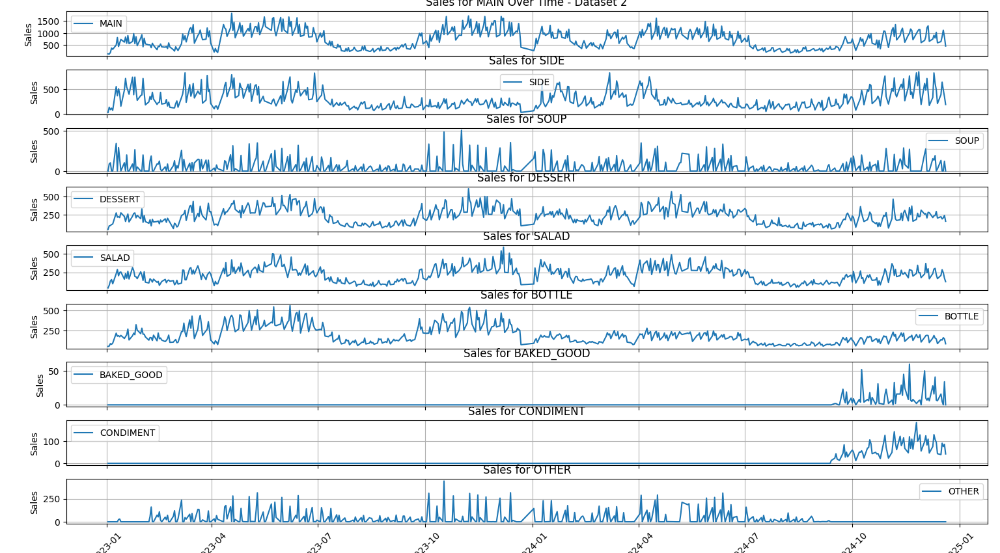
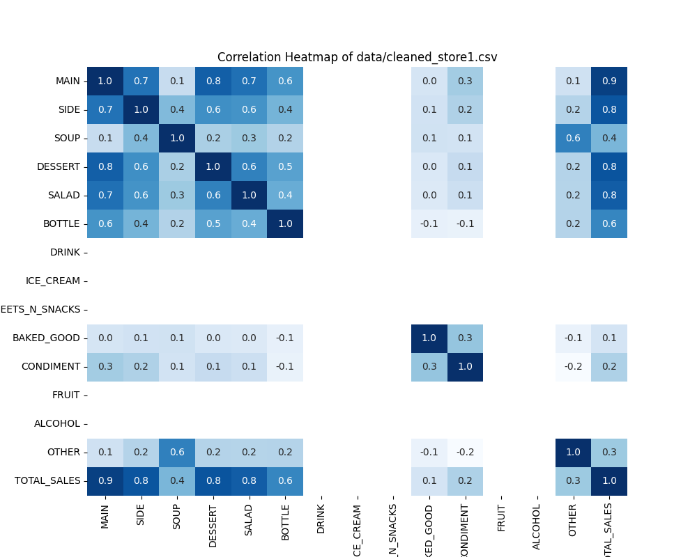
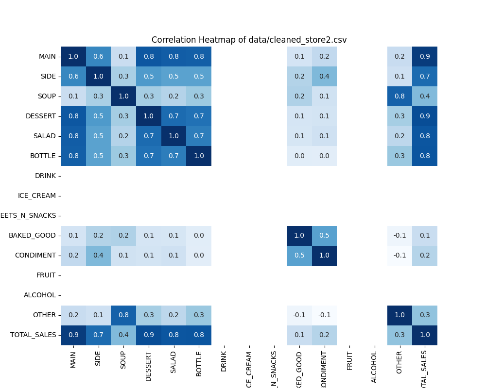
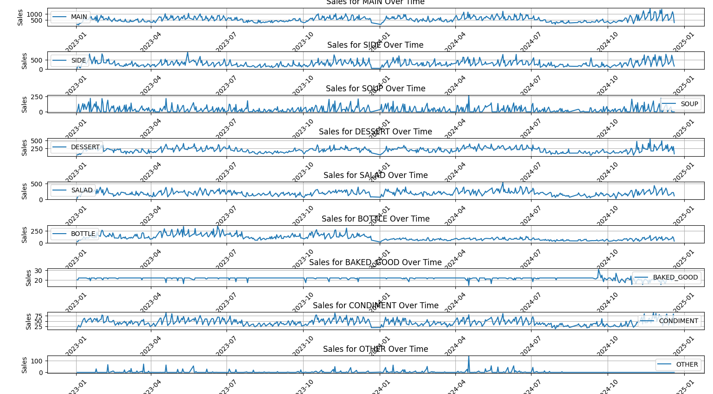
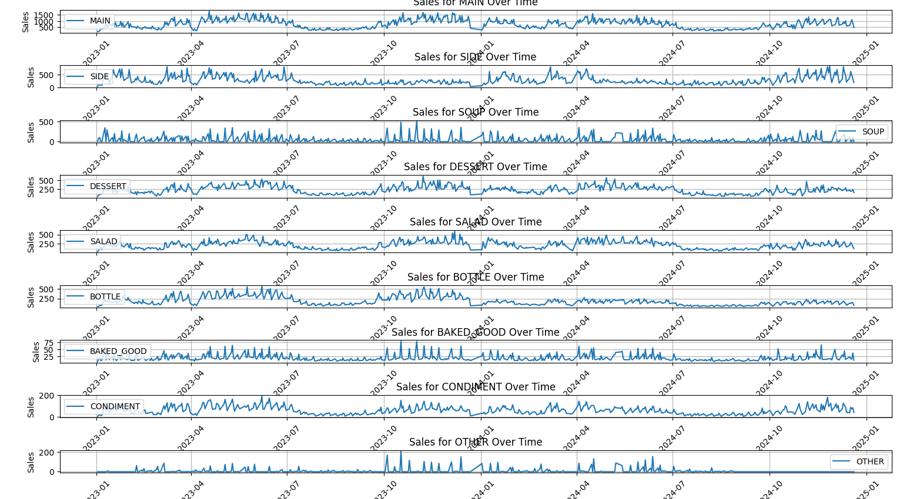

# AI in Practice – VisioLab Final Project: Demand Prediction

Welcome to my public portfolio copy of our group's final project for the **"AI in Practice – How to Get Away from Jupyter Notebooks"** university course at Universität Osnabrück, in partnership with **VisioLab**.

This repository demonstrates end-to-end time series forecasting, feature engineering, model optimization, and real-world deployment for sales prediction, using both the Prophet and XGBoost frameworks. 

It showcases:
- Collaboration on complex, business-relevant data science problems.
- Practical ML engineering: RESTful deployment, experiment tracking, and reproducible pipelines.
- Transparent documentation, high code quality, and replicable results (with synthetic/sample data).

---

## ⚠️ Privacy & Data Policy

- **This is a public, portfolio-oriented version of the original internal project**.  
- **All sensitive and client data (raw sales, business/private info in `/data/`) has been deleted or replaced with example files.**
- All modeling code, engineering workflows, and documentation are retained for educational and recruiting purposes.
- Please refer to the [original private repository](https://github.com/AI-in-Practice-UOS/DemandPredictionProject) for full collaboration context (access required).

---

## Project Summary

The aim is to predict:
- Total number of food items sold per day
- Per-category item sales in every 15-minute interval
- Deliver interpretable results via a production-ready REST API

## Dataset

- datasets are stored in the `data/` directory.
- `store1.csv` and `store2.csv` contain all data from 2023 -2024 respectively.
- Each day’s data is segmented into 15-minute intervals.
- Each interval records the number of items sold per category.
- Items are distinguished by the following categories
  - MAIN
  - SIDE
  - SOUP
  - DESSERT
  - SALAD
  - BOTTLE
  - DRINK
  - ICE_CREAM
  - SWEETS_N_SNACKS
  - BAKED_GOOD
  - CONDIMENT
  - FRUIT
  - ALCOHOL
  - OTHER
- For training and evaluation we did a 80/20 percent data split. Which means, that all data after Ocotober 2024 is beign used for testing.
- Data from 2025 will be tested by VisioLab for the evaluation of our project. 

## API Design

The REST API should support two routes:

 1. Given an ISO date and the store, return the total number of predicted item sales for that day.
 2. Given an ISO timestamp and the store, return the predictions for all categories for the closest previous 15-minute interval.
 3. Return proper responses for stores and dates for which no predictions can be generated.

## ML Approach

# Project Title

## Task Overview
Provide a brief description of the task, including the objectives and what the project aimed to achieve. Mention the type of data used and the key goals of the analysis.

Example:
- Goal: Predict housing prices using various features (e.g., location, square footage, number of rooms).
- Type of Data: CSV dataset containing housing information, including numerical and categorical variables.

---

## Data Insights & Visualizations

### Initial Data Exploration

To gain a preliminary understanding of the dataset, we conducted several visual analyses:  

- **Sales Trends Over Time:**  
  - We examined the yearly sales trends for each store and found that both followed a similar pattern.  
  - Based on this observation, we decided to use **a single model** for both stores.  
  - Below, you can find the **total daily sales** over the full **two-year period** for both stores, along with a **smoothed variation** for better trend visualization.  

- **Daily Sales Patterns:**  
  - We analyzed the average sales per time interval for both stores to understand intra-day sales fluctuations.  

- **Weekly Sales Averages:**  
  - Lastly, we calculated and visualized the **average sales per day of the week** for each store to identify weekly trends.  
## Data Insights & Visualizations

### Initial Data Exploration

To gain a preliminary understanding of the dataset, we conducted several visual analyses:  

- **Sales Trends Over Time:**  
  - We examined the yearly sales trends for each store and found that both followed a similar pattern.  
  - Based on this observation, we decided to use **a single model** for both stores.  

  
  

  

- **Daily Sales Patterns:**  
  - We analyzed the average sales per time interval for both stores to understand intra-day sales fluctuations.  

  

  

- **Weekly Sales Averages:**  
  - Lastly, we calculated and visualized the **average sales per day of the week** for each store to identify weekly trends.  

  

  

These insights helped us better understand seasonality, daily variations, and store similarities before proceeding with modeling.  

---

## Data Preprocessing & Imputation  

### Handling Missing Values  

The **Baked Goods** and **Condiments** sales data were only recorded starting in **October 2024**, resulting in missing values for earlier dates. To address this:  

- We analyzed the correlation between the **Baked Goods** and **Condiments** and all other columns.  
- A **linear regression model** was trained separately for each store to predict the missing values based on correlated data.  
- To ensure that the **total daily sales** remained unchanged, the newly imputed values for **Baked Goods** and **Condiments** were subtracted from the **"Other"** category.  

### Summary of Imputation Strategy  

| Missing Columns     | Imputation Method |
|--------------------|------------------|
| `Baked Goods`, `Condiments` | Linear Regression (Store-Specific) |
| `Other` (Adjusted) | Rebalanced to Maintain Total Sales |

Below, you can find:  
- Sales per category **before imputation**  
- **Correlation matrices** used for model training  
- Sales per category **after imputation**  
### Sales per Category Before Imputation  

  
  

### Correlation Matrices Used for Model Training  

  
  

### Sales per Category After Imputation  

  
  

This ensures that our data remains accurate while preserving the original total sales distribution.  
---

## Models & Results

### 1. Problem Definition

Our project aims to forecast:
1. **Daily total food sales** for two stores (aggregate).
2. **Category-level sales** in each **15-minute interval** (finer granularity).

**Significance**:  
- Enhanced **inventory management** and **staff scheduling** to match real demand.  
- Captures dynamic **student population** cycles and local **holiday effects** (critical in Osnabrück context).

---
### 4. Feature Engineering

We employed targeted transformations to boost accuracy:

1. **Outlier Handling**  
   - **Winsorization** to limit extreme outliers.

2. **Data Smoothing**  
   - **Rolling median** reduced short-term noise.

3. **Holiday & Semester Features**  
   - **Christmas Break** (Dec 22 – Jan 2) and **summer break** (late July – mid-September).
   - Semester phases (winter vs. summer) flagged as regressors.

4. **Bayesian Optimization**  
   - Refined hyperparameters (`changepoint_prior_scale`, `seasonality_prior_scale`, `holidays_prior_scale`) in Prophet, plus XGBoost’s tuning for depth, learning rate, etc.

### 5. Model Implementation

We try out different models but ultimately land on Prophet for daily total sales and XGBoost for Interval sales per category.
Our goal is to connect models at multiple levels of the hierarchy, by reconciliating across their predictions, using Min Trace reconciliation with historic residuals.

### Selected Model: Prophet (Facebook)

**Why Prophet?**  
- Handles seasonality and holidays effectively.
- Robust to missing values and outliers.
- Supports adding custom regressors (e.g., semester breaks, holidays).

 **Technical Implementation:**
- Framework: `Prophet` (Python API).
- Custom regressors: Semester phases and recognized German holidays included to enhance prediction accuracy during known breaks.

### Libraries & Tools
- `pandas` and `numpy` for data processing.
- `scikit-learn` for Linear Regression (imputation).
- `scikit-optimize` (skopt) for Bayesian hyperparameter tuning.
- `MLflow` for experiment tracking.
- `joblib` for model saving/loading.
- `matplotlib` for data visualization.

**Hyperparameter Optimization:**
- Utilized **Bayesian Optimization** (`skopt`) to identify optimal values for:
  - `changepoint_prior_scale`: controlling trend flexibility.
  - `seasonality_prior_scale`: tuning the strength of seasonality effects.
  - `holidays_prior_scale`: tuning holiday impacts.

### Custom Feature Engineering  
- Included **semester-phase** and **German holidays** as regressors.

### **2. XGBoost (15-Minute Intervals)**
**Why XGBoost?**
- Strong performance on **tabular data** with short interval-based features.
- Flexible handling of **non-linear relationships**.
- Easy integration of **time-based features** (e.g., hour, day-of-week, historical lags).

**Experimentation**:
In the "experiments" folder the experimentation pipeline is explained in more detail.
- **Feature-Extraction**
  - XGBoost is a regression model and needs temporal and other features to be numbers
  - extracting temporal and calendar features
- **Cross-Validation**:
  - Time-based or repeated K-fold to ensure robust interval-level performance metrics.
- **Tracking**
  - Experiments can be set up using a configuration file, that allows grid or random search. The individual runs are tracked using MLflow.
- **Model Usage**:
  - Typically used for finer category-level forecasting (i.e., how many DESSERT items in a 15-minute window).

---
### Alternative Approaches Considered:
LSTM: Initially considered for its strength in handling sequential data. However, we discarded it due to data complexity, limited training data, and minimal interpretability benefits over Prophet for our specific case.

### 6. Evaluation & Results
why are these 2 metrics" MAE, RMSE"?

- **Mean Absolute Error (MAE):** The average of absolute differences between forecasted values and actual values. It is scale-dependent (in the units of the data) and gives a linear weight to errors. MAE is easy to interpret – e.g., an MAE of 50 means the forecast is off by 50 (units) on average. It’s more robust to outliers than MSE/RMSE (since it doesn’t square the error).
- **Root Mean Squared Error (RMSE):** The square root of the average of squared errors. RMSE also has the same units as the data. By squaring the errors, it penalizes large errors more heavily (so a few large mistakes will increase RMSE significantly). It is a very common metric in forecasting competitions and research. Lower RMSE indicates a better fit. RMSE is useful when large errors are particularly undesirable.

## 📊 Evaluation & Results

### Evaluation Strategy:
- **Time-Series K-Fold Cross-Validation** (5-fold) performed over the last 90 days of data.
- **Evaluation Metrics**:
  - **Mean Absolute Error (MAE)** – Measures average magnitude of prediction errors.
  - **Root Mean Squared Error (RMSE)** – Emphasizes larger prediction errors.

### Model Performance Overview:

| Model               | Store   | Avg. MAE | Avg. RMSE |
|---------------------|---------|----------|-----------|
| Baseline Prophet    | Store 1 | 1491.23  | 1911.82   |
| **Optimized Prophet** | **Store 1** | **202.22**  | **262.68** |
| Baseline Prophet    | Store 2 | 4675.65  | 5453.38   |
| **Optimized Prophet** | **Store 2** | **444.03**  | **560.20** |

**Insights Gained**:
- Inclusion of custom regressors (holidays, semesters) significantly improved forecasting accuracy.
- Optimized Prophet model consistently outperformed the baseline.

Interesting Observations:

Incorporating semester phases and custom holidays notably improved Prophet's predictive accuracy, validating the effectiveness of domain-informed feature engineering.
Winsorization and smoothing methods greatly stabilized the forecasts, reducing short-term fluctuations and error variance.

### XGBoost and Hierarchical reconciliation
Especially for combining the power of Prophet for daily prediction and the less constrained capabilities of XGBoost for Interval and category predictions, it seemed reasonable to use a reconciliation approach to combine the learned patterns at multiple levels of the temporal and catagorical hierarchy.
### training XGBoost models

| model            | colsamp | lr   | max_d | n_est | subsamp | rmse_1 | rmse_2 | total_rmse |
| ---------------- | ------- | ---- | ----- | ----- | ------- | ------ | ------ | ---------- |
| int_all_all      | 0.8     | 0.1  | 7     | 1000  | 0.7     | 2.04   | 2.6    |            |
| int_all_total    | 0.9     | 0.05 | 7     | 800   | 0.6     | 9.76   | 12.72  |            |
| hour_all_all     | 0.8     | 0.05 | 7     | 1000  | 0.8     | 5.59   | 7      |            |
| hour_all_total   | 0.9     | 0.01 | 10    | 1000  | 0.8     | 22.78  | 28.67  |            |
| day_all_all      | 0.8     | 0.02 | 8     | 1000  | 0.7     | 47.61  | 62.07  |            |
| day_all_total    | 0.8     | 0.05 | 7     | 800   | 0.6     | 178.86 | 215.36 |            |
| day_total_total  | 0.7     | 0.01 | 10    | 1000  | 0.6     |        |        | 500        |
| week_all_all     | 0.7     | 0.05 | 8     | 700   | 0.8     | 293.4  | 400.03 |            |
| week_all_total   | 0.7     | 0.1  | 4     | 1000  | 0.7     | 1492   | 2255   |            |
| week_total_total | 0.8     | 0.01 | 4     | 500   | 0.7     |        |        | 5541       |

Each model makes predictions at a temporal, location and categorical level of the hierarchy (i.e. int_all_all predicts interval sales for each store and each category).
The experiments are described in more detail in experiments/evaluation/experiments.md.

### Hierarchical reconciliation
Unfortunately it was very difficult to gain meaningful insights into wether reconciliation improved the forecasts. Since there is not very much data, the models at higher levels of the hierarchy have very few training samples. 

### 7. Final Model & Deployment

### Final Model Selection
- **Optimized Prophet** for daily totals:
  - Dominated in accuracy post-optimization.
  - Offered clear interpretability.
- **XGBoost** for fine-grained intervals:
  - Superior for category-level predictions every 15 minutes.
- **Hierarchical reconciliation** for combining different levels:
  - Hierarchically organized dataset for 2025 can be used to produce reconciliated predictions across different levels
- **Deployment**: 
  - Each model can be serialized (e.g., `joblib`) and exposed via a REST endpoint.
  - Monthly/quarterly retraining recommended to maintain performance.

**Reasoning**:
1. **Accuracy**: Repeatedly lowest MAE & RMSE in test folds.
2. **Interpretability**: Both Prophet (for daily) & XGBoost (for intervals) are more transparent than an LSTM approach.
3. **Flexibility**: 
   - Prophet easily accommodates domain knowledge (holidays, breaks).
   - XGBoost easily handles tabular time-lag features for intervals.

**Future Considerations**:
- Continuous data streaming for real-time forecast updates.
- Potential ensemble methods combining daily Prophet with interval-based XGBoost for maximum synergy.
---

## References  

- [Project Repository](https://github.com/AI-in-Practice-UOS/DemandPredictionProject)  
- Dataset Source (if applicable)  
- Any relevant research papers or external resources  

### Contributors  
- [@asera-1](https://github.com/asera-1)  
- [@mspreen](https://github.com/gittermarie)  
- [@iritter](https://github.com/iritter)  

