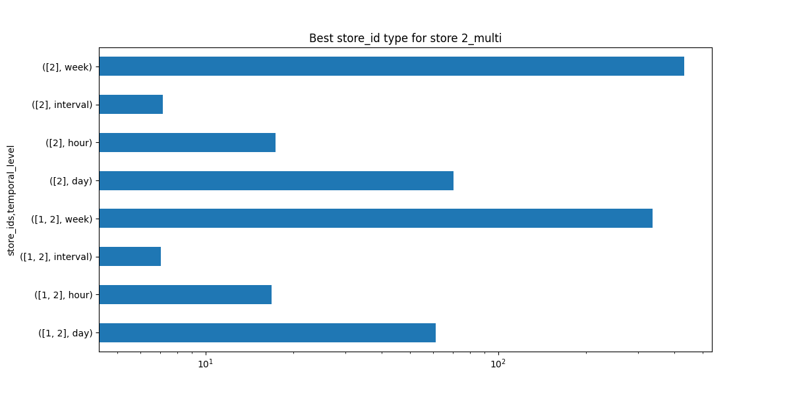
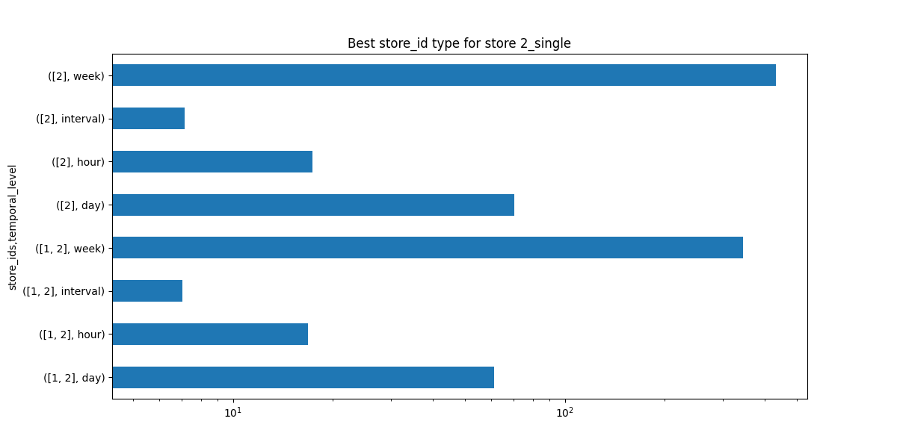
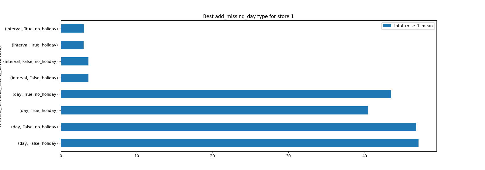
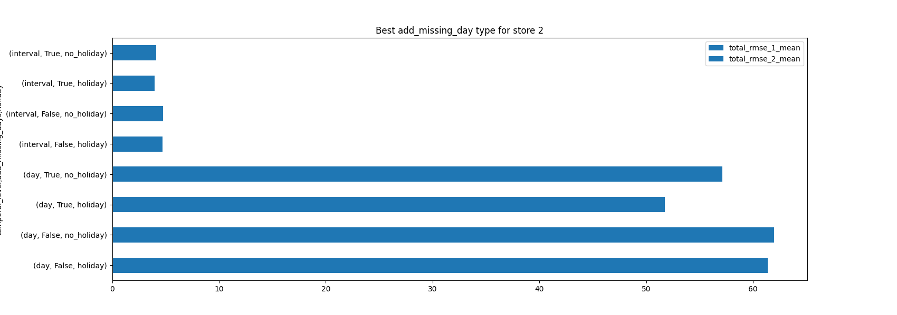
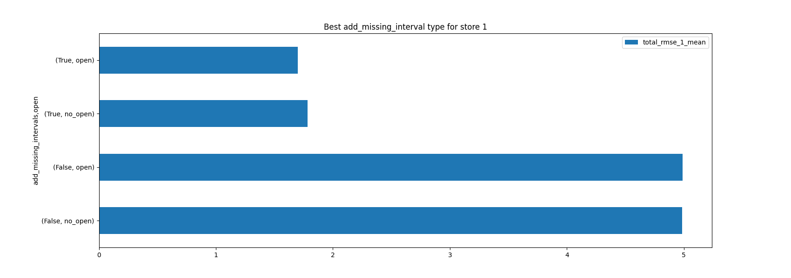
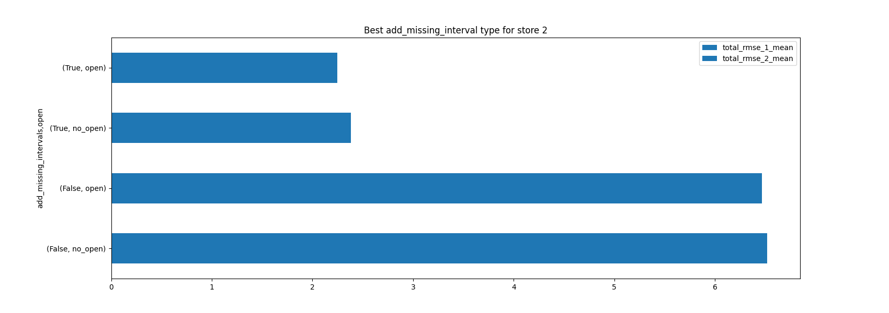
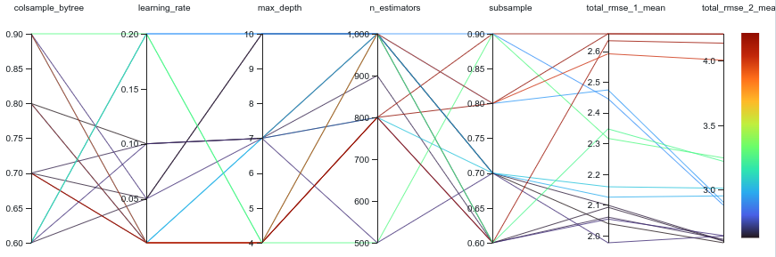
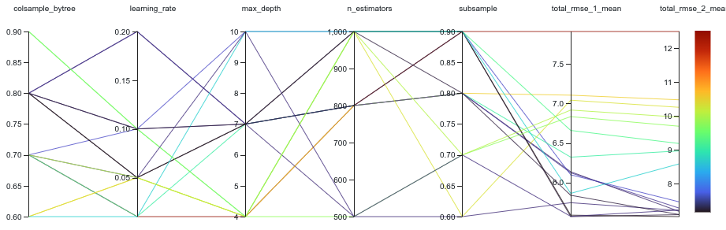
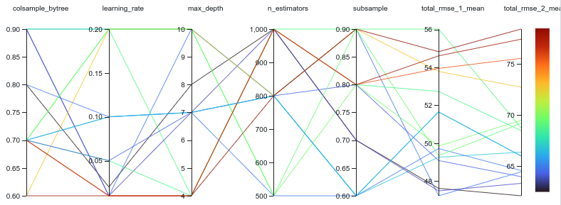
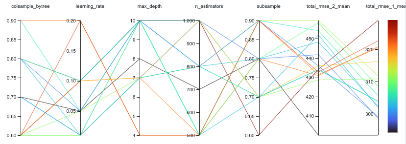

# XGBoost Experiments

We want to find the "best" models for each relevant point of the hierarchy. Points of uncertainty are: 
- multi prediction of single prediction models? 
- add missing intervals and days? (and does holiday/open feature make a difference?)
- features
- model hyperparameters
### model - levels:
{temporal_level}\_{location_level}\_{category_level}
### metrics:
- repeated kfold: 80/20 split, 3 repeats
	- rmse, mae (for each)
- visualize time-based split performance on last months and future dates

## Test multi vs. single prediction

Perform grid search for 6 runs (prediction_types: ["multi", "single"] store_ids: [[1], [2], [1,2]]) for each level with default model_parameters and with all level-appropriate time features and non-zero targets included.
#### Hypothesis:
multi prediction does better.
### Conclusion:
- Single vs. Multi makes no difference across levels
- both stores performs consistently better than single stores

## Test adding missing intervals/days

Perform grid search for  [True, False] for adding missing values, using a single or multi model and including all level-appropriate time features.

hypothesis: Predictions are more accurate without missing intervals but more accurate with missing days.

- interval level: 
	- experiment 1: 4 * 2 runs, [True, False] for add_intervals and add_days (across single, multi)
	- experiment 2: same as 1 but add holidays and open features
- day level 
	- experiment 1: 2 * 2 runs, [True, False] for add_days (across single, multi)
	- experiment 2: same as 1 but add holidays feature 

### Conclusion
- adding missing days and intervals significantly improves model performance at the day and interval level
- holiday and open features further improve model performance (especially at the day level)

#### Adding missing days

#### Adding missing intervals

## Model Hyperparameters

For each model level perform random Hyperparameter search, using single and multi model. Use Hyperparameter options:
- max_depth: [4, 7, 10]
- n_estimators: [500, 800, 1000]
- learning_rate: [0.01, 0.05, 0.1, 0.2]
- subsample: [0.6, 0.7, 0.8, 0.9]
- colsample_bytree: [0.6, 0.7, 0.8, 0.9]

Do random search across 15 runs for each level:
- interval level
- hour level
- day level
- week level

### Hypothesis

- max_depth: higher is better
- n_estimators: higher is better
- learning rate: 0.05 or 0.1
- subsample: 0.8 to avoid overfitting
- colsample_bytree: 0.7 or 0.8

### Conclusion

| model            | colsamp | lr   | max_d | n_est | subsamp | rmse_1 | rmse_2 | total_rmse |
| ---------------- | ------- | ---- | ----- | ----- | ------- | ------ | ------ | ---------- |
| int_all_all      | 0.8     | 0.1  | 7     | 1000  | 0.7     | 2.04   | 2.6    |            |
| int_all_total    | 0.9     | 0.05 | 7     | 800   | 0.6     | 9.76   | 12.72  |            |
| hour_all_all     | 0.8     | 0.05 | 7     | 1000  | 0.8     | 5.59   | 7      |            |
| hour_all_total   | 0.9     | 0.01 | 10    | 1000  | 0.8     | 22.78  | 28.67  |            |
| day_all_all      | 0.8     | 0.02 | 8     | 1000  | 0.7     | 47.61  | 62.07  |            |
| day_all_total    | 0.8     | 0.05 | 7     | 800   | 0.6     | 178.86 | 215.36 |            |
| day_total_total  | 0.7     | 0.01 | 10    | 1000  | 0.6     |        |        | 500        |
| week_all_all     | 0.7     | 0.05 | 8     | 700   | 0.8     | 293.4  | 400.03 |            |
| week_all_total   | 0.7     | 0.1  | 4     | 1000  | 0.7     | 1492   | 2255   |            |
| week_total_total | 0.8     | 0.01 | 4     | 500   | 0.7     |        |        | 5541       |

#### interval level:

#### hour level: 

#### day level:

#### week level:
